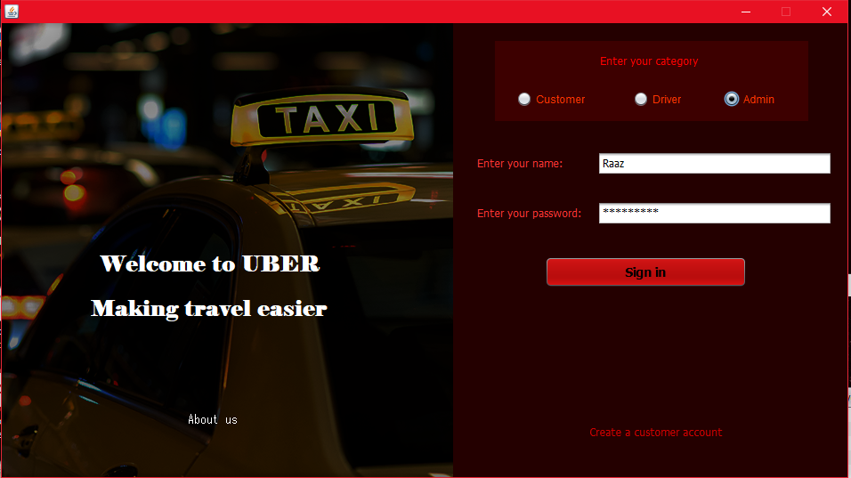
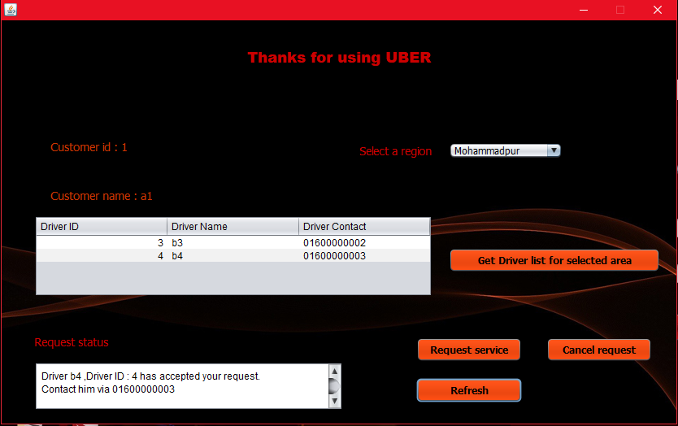
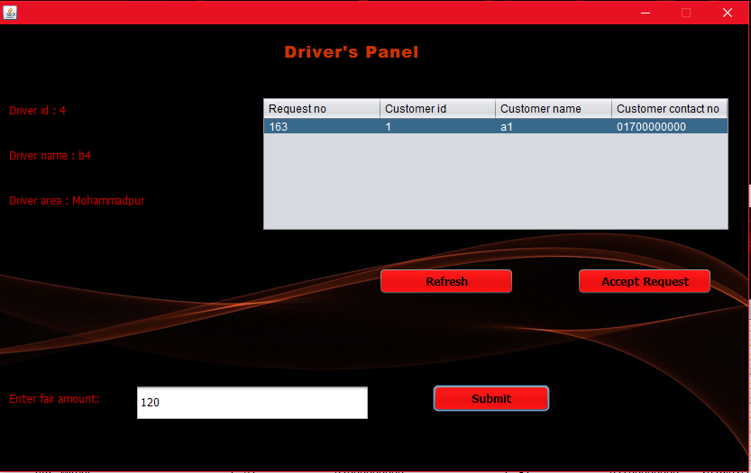
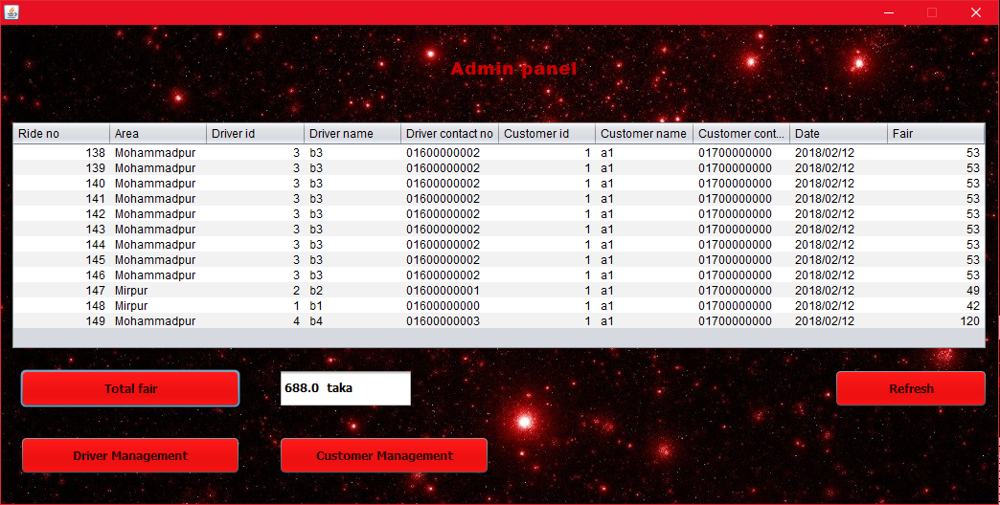
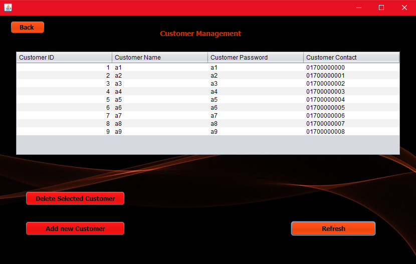
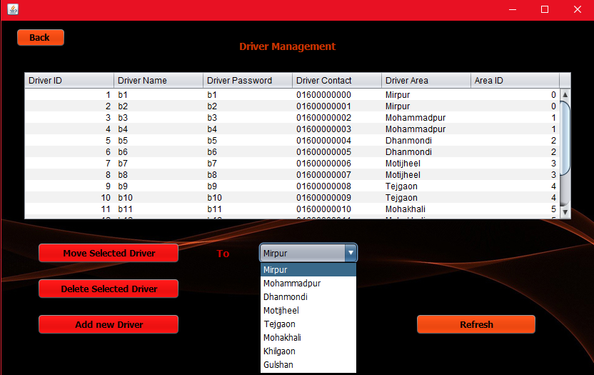
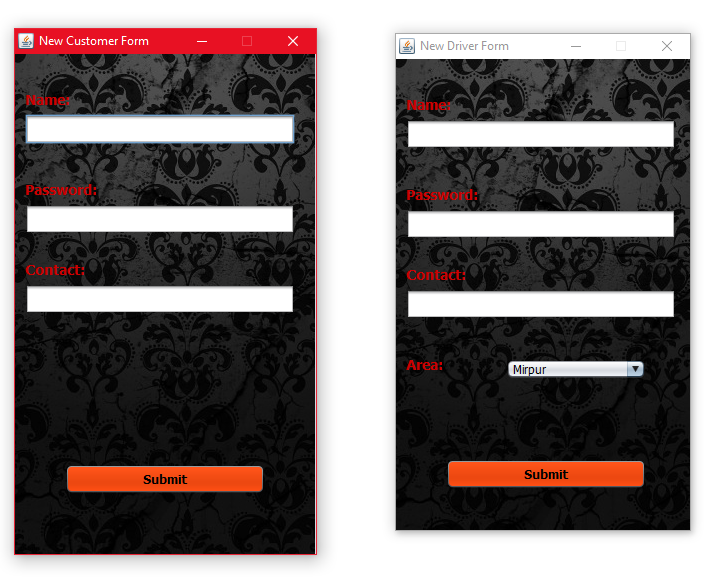
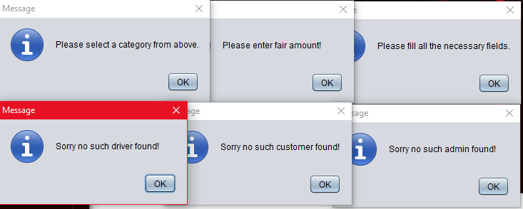
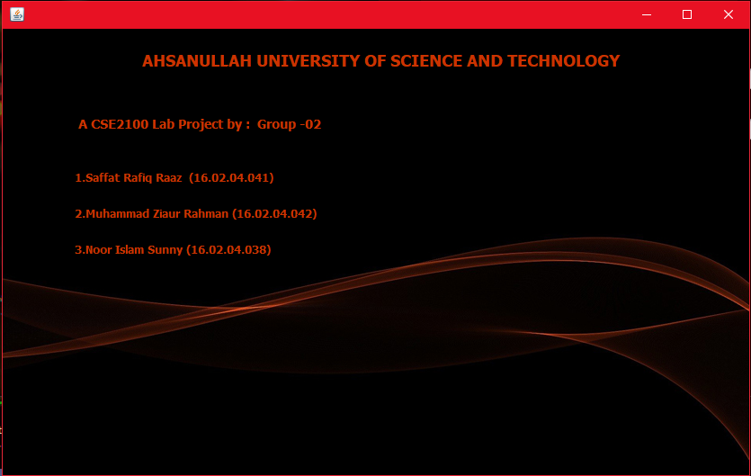

# Uber Management System
 This is an Uber management system for customers,drivers and admins for tracking and managing uber rides. This app has been made using java and Apache Derby database.
 
:fleur_de_lis:**Login form :**

:fleur_de_lis:**Customer form :**

:fleur_de_lis:**Driver form :**

:fleur_de_lis:**Admin form :**

:fleur_de_lis:**Customer management form (Admin) :**

:fleur_de_lis:**Driver management form (Admin) :**

:fleur_de_lis:**New forms for adding customers and drivers :**

:fleur_de_lis:**Various error messages :**

:fleur_de_lis:**Credit form :**

